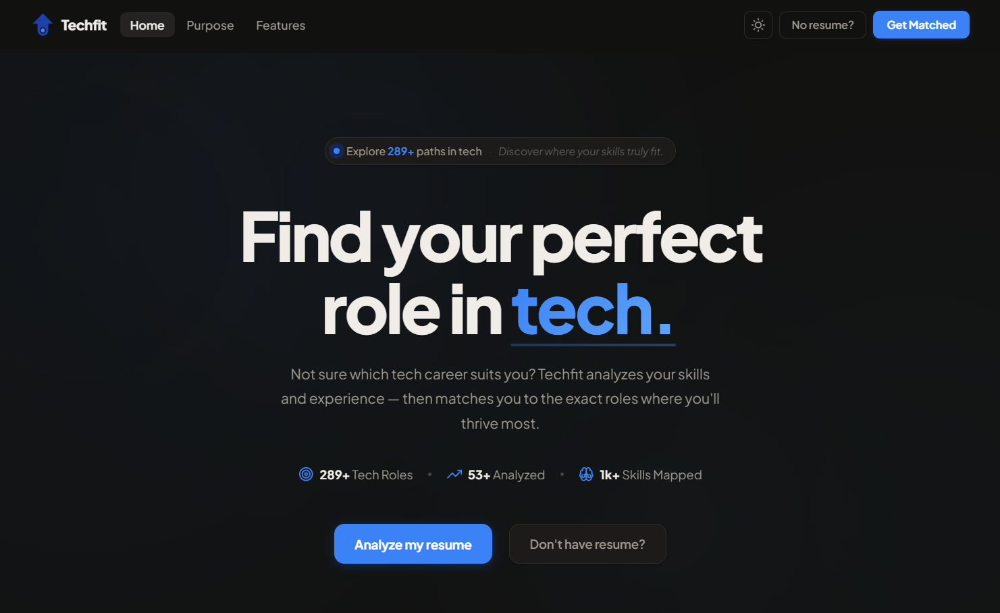

# Techfit — Find Your Perfect Role in Tech

> Techfit is a personal project built to help people see where their skills fit in the tech industry. 

 

## Why i built this?

I built this app because I kept asking myself a simple question:
"Where do my skills actually fit in tech?"
Am I leaning more toward Cybersecurity? Software Engineering? Or AI/ML?
My skills were spread across multiple areas and it wasn't obvious which direction they pointed to. Instead of guessing, I decided to build a tool that could analyze it.
Techfit is a full-stack application built with a React + TypeScript frontend and a FastAPI backend. It uses semantic similarity matching powered by Sentence Transformers to find the tech roles that most closely align with your skills and experience — not just keyword matching, but actual contextual understanding of what you know and what you've done.
The goal is simple:

Based on your skills and experience, what tech role do you actually fit into?

This tool was built for three kinds of people: tech students who are finishing their degree but haven't found their direction yet, the undecided who are drawn to the industry but aren't sure if IT is really for them, and career shifters who come from a different field but believe their skills can transfer. I was one of these people myself — and if you are too, Techfit was made for exactly that moment.

 

## What is Techfit?

The tech industry is vast, and finding exactly where a specific set of skills fits can feel overwhelming. Techfit was engineered to remove the guesswork and bridge the gap between raw experience and the ideal career path.

Whether you're a **tech student** unsure which path to take, someone **second-guessing** if the IT industry is right for you, or a **career shifter** coming from a non-tech background — Techfit was built for you.

> *"Not everyone enters the tech industry knowing exactly where they belong. Techfit exists to close that gap — giving every aspiring tech professional a clear, data-driven answer to the question: what role is actually right for me?"*

 

## How It Works

**1. Secure Upload**
Drop your PDF, TXT, or Markdown resume. Text is extracted and processed entirely in memory — nothing is saved, logged, or shared.

**2. Skill Extraction + Semantic Analysis**
The backend cleans the resume text and detects skills against a known skills index built from the role dataset. It then constructs a rich context string combining extracted skills and full experience text, which gets encoded into a high-dimensional vector using **Sentence Transformers** (`all-MiniLM-L6-v2`).

**3. Cosine Similarity Matching**
The resume embedding is compared against pre-computed role embeddings using **cosine similarity**. The top 3 closest matches are returned — ranked by how semantically aligned your background is to each role.

**4. Your Results**
You get a ranked list of the 3 tech roles you're most suited for, each with a confidence score, required skills, and a role description.

 

## Tech Stack

### Frontend
- **React + TypeScript** — component-based UI with full light/dark theme support
- **Vite** — fast dev server and build tool

### Backend
- **FastAPI** (Python) — async REST API
- **Sentence Transformers** — `all-MiniLM-L6-v2` for semantic resume + role embeddings
- **scikit-learn** — cosine similarity for role matching
- **joblib + NumPy** — pre-computed role embeddings and role dataframe loaded at startup via lifespan
- **Supabase** — tracks total resumes analyzed (live counter)

 

## Coming Soon

- **Skill Gap Analysis** — See exactly which skills would boost your match for a target role
- **Personalized Roadmaps** — Step-by-step learning paths tailored to where you want to go
- **Role Comparison Tool** — Compare two roles side by side against your skill set
- **Resume Improvement Tips** — Actionable suggestions to strengthen your resume
- **Exportable Reports** — Download your matches and roadmap as a clean PDF

 

## Who Is This For?

- **Tech Students** — finishing a degree but unsure which specialization to pursue
- **The Undecided** — drawn to tech but not sure if it's really for them
- **Career Shifters** — coming from non-tech backgrounds with transferable skills

 

---

**Developed by Rasheed Gavin** — Aspiring Software and AI/ML Engineer
*A full-stack + NLP project built to solve a real problem: helping people find where they truly belong in tech.*